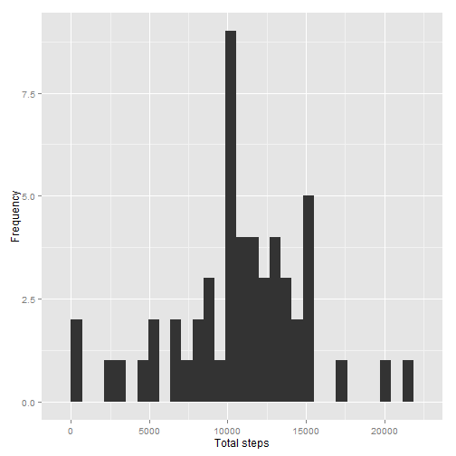
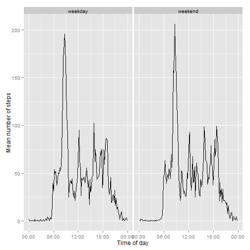

# Reproducible Research: Peer Assignment 1
---


## Loads and Preprocess data
Reads the data.

```r
if (!file.exists("activity.csv")) {
    unzip("activity.zip")
}
activity <- read.csv("activity.csv")
```

Creates a date.time column that combines date and interval columns.

```r
time <- formatC(activity$interval/100, 2, format = "f")
activity$date.time <- as.POSIXct(paste(activity$date, time), format = "%Y-%m-%d %H.%M", 
    tz = "GMT")
```

Analyzes the mean at different times of day, it is convenient to have a time column. So I convert all of the dates to be for today. since we only care about the time for that column, it will help with the analysis.

```r
activity$time <- format(activity$date.time, format = "%H:%M:%S")
activity$time <- as.POSIXct(activity$time, format = "%H:%M:%S")
```

## What is mean total number of steps taken per day?
Calculates the mean number of steps for each day:

```r
total.steps <- tapply(activity$steps, activity$date, sum, na.rm = TRUE)
```

Mean and median for the total steps per day:

```r
mean(total.steps)
```

[1] 9354

```r
median(total.steps)
```

[1] 10395

Distribution of total number of steps per day with a histogram:

```r
library(ggplot2)
qplot(total.steps, xlab = "Total steps", ylab = "Frequency")
```

```
## stat_bin: binwidth defaulted to range/30. Use 'binwidth = x' to adjust this.
```

 

## What is the average daily activity pattern?
Calculates the mean steps for each five minute interval, and then put it in a data frame.

```r
mean.steps <- tapply(activity$steps, activity$time, mean, na.rm = TRUE)
daily.pattern <- data.frame(time = as.POSIXct(names(mean.steps)), mean.steps = mean.steps)
```

Look at a time series plot for the mean steps.

```r
library(scales)
ggplot(daily.pattern, aes(time, mean.steps)) + geom_line() + xlab("Time of day") + 
    ylab("Mean number of steps") + scale_x_datetime(labels = date_format(format = "%H:%M"))
```

 

Which five minute interval has the highest mean number of steps?

```r
most <- which.max(daily.pattern$mean.steps)
format(daily.pattern[most, "time"], format = "%H:%M")
```

[1] "08:35"

## Imputing missing values
Identify the number of intervals with missing step counts ("NA's"):

```r
summary(activity$steps)
```

   Min. 1st Qu.  Median    Mean 3rd Qu.    Max.    NA's 
    0.0     0.0     0.0    37.4    12.0   806.0    2304 

To fill the missing values, use mean steps for a 5 minutes interval for the entire dataset.

```r
activity.imputed <- activity
activity.imputed$steps <- with(activity.imputed, activity.imputed$steps, mean)
```

Compares the mean and median steps for each day between the original data set and the imputed data set.

```r
total.steps.imputed <- tapply(activity.imputed$steps, activity.imputed$date, 
    sum)
mean(total.steps)
```

[1] 9354

```r
mean(total.steps.imputed)
```

[1] NA

```r
median(total.steps)
```

[1] 10395

```r
median(total.steps.imputed)
```

<NA> 
  NA 

And a histogram of the imputed dataset.

```r
qplot(total.steps.imputed, xlab = "Total steps", ylab = "Frequency")
```

```
## stat_bin: binwidth defaulted to range/30. Use 'binwidth = x' to adjust this.
```

 

Input of the missing data has increased the average number of steps.
## Are there differences in activity patterns between weekdays and weekends?
Add a factor column for whether a day is a weekday or weekend.

```r
day.type <- function(date) {
    if (weekdays(date) %in% c("Saturday", "Sunday")) {
        return("weekend")
    } else {
        return("weekday")
    }
}
day.types <- sapply(activity.imputed$date.time, day.type)
activity.imputed$day.type <- as.factor(day.types)
```

Creates a dataframe that holds the mean steps for weekdays and weekends.

```r
mean.steps <- tapply(activity.imputed$steps, interaction(activity.imputed$time, 
    activity.imputed$day.type), mean, na.rm = TRUE)
day.type.pattern <- data.frame(time = as.POSIXct(names(mean.steps)), mean.steps = mean.steps, 
    day.type = as.factor(c(rep("weekday"), rep("weekend"))))
```

Compares patterns between weekdays and weekends.

```r
ggplot(day.type.pattern, aes(time, mean.steps)) + geom_line() + xlab("Time of day") + 
    ylab("Mean number of steps") + scale_x_datetime(labels = date_format(format = "%H:%M")) + 
    facet_grid(. ~ day.type)
```

 

